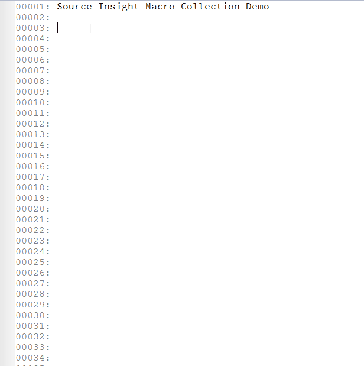
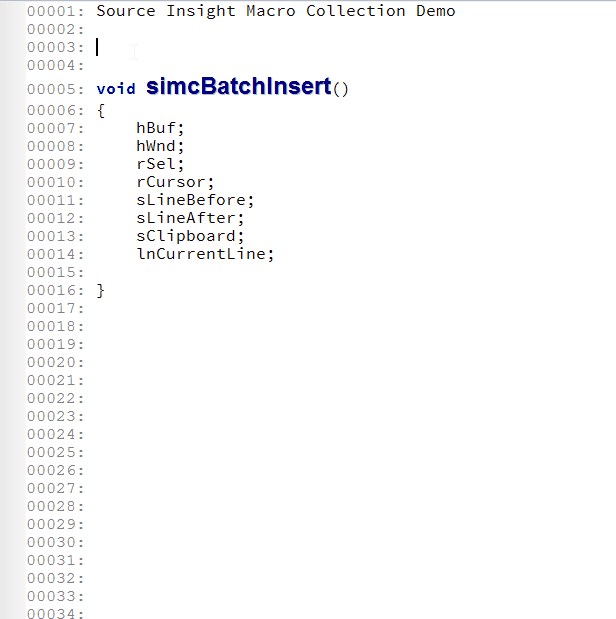
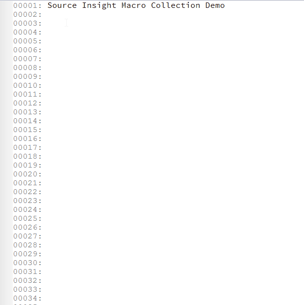
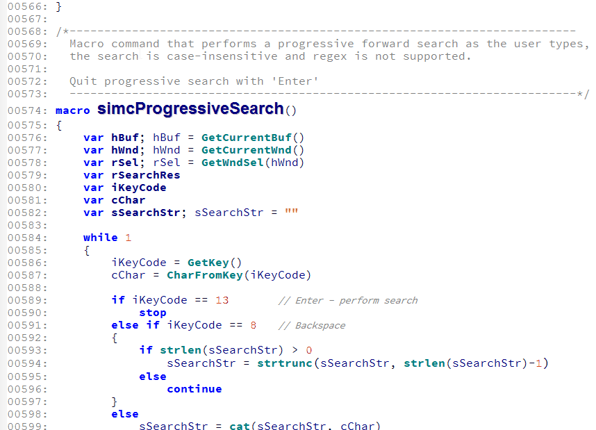

Source Insight Macro Collection
===============================

A collection of Source Insight macros.

## Installation

- Add `simc.em` to your project, or to the base project so that you just need to do it once for all your projects.
- From menu "Options" -> "Key Assignments..." to bind any macro functions in this file to keys. Macros start with `simc` are from this package.

## Demo

### Snippets

### Surrounder

### Batch Insert

                                                            

### Fast commenting

### Fast locating delimiter pairs

### Progressive search

